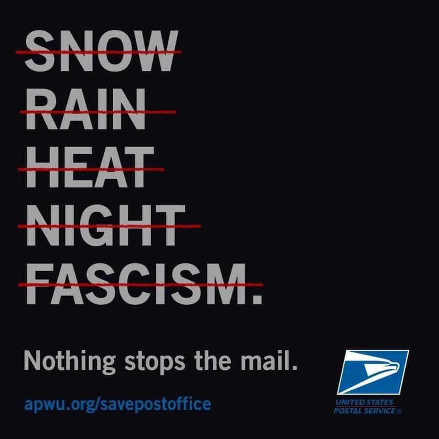

I never thought I would be writing a post like this. But to be fair, it's 2020, so maybe it should not be that big of a surprise. 

When I was young, I was around mail all the time. My dad worked for Pitney Bowes and worked very closely with USPS. He was also the President of Lower Loudoun Little League and I often found myself using a mail folder (yes, this is a real thing) to help stuff envelopes for different Little League events. Honestly, I didn't like the mail. It was boring. It really didn't seem cool at all.

That's all changed though. As I grew older, I depended on the mail more and more. I didn't notice it and I took it completely for granted, but the consistency of the mail was just as important as any other utility. Electricity? Just as important. Gas? Just as important. Water? Ok, not AS important, but a close second!

The assult on the USPS and our mail infrastructure is unprecedented. People will suffer. The economy will suffer. 

**Speak up. Contact your representatives.**

### Need Help with a List of Action Items?
1. Call your Senators. [202-224-3121](tel:202-224-3121)
2. Register to vote. Go to [vote.org](https://vote.org) even if you think you've registered and double-check.
3. Go to [US Vote Foundation](https://www.usvotefoundation.org/vote/eoddomestic.htm) and get them to make secure drop boxes available.